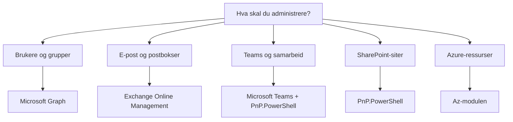

# PowerShell-moduler for Microsoft 365 administrasjon

## 📚 Innholdsfortegnelse
1. [Hva er PowerShell-moduler?](#hva-er-powershell-moduler)
2. [Oversikt over Microsoft 365-moduler](#oversikt-over-microsoft-365-moduler)
3. [Installere og administrere moduler](#installere-og-administrere-moduler)
4. [Microsoft Graph PowerShell](#microsoft-graph-powershell)
5. [Exchange Online Management](#exchange-online-management)
6. [Microsoft Teams PowerShell](#microsoft-teams-powershell)
7. [Andre nyttige moduler](#andre-nyttige-moduler)
8. [Feilsøking](#feilsøking)
9. [Beste praksis og sikkerhet](#beste-praksis-og-sikkerhet)

---

## Hva er PowerShell-moduler?

PowerShell-moduler er pakker med ferdiglagde kommandoer (cmdlets), funksjoner og skript som utvider PowerShells funksjonalitet. Tenk på dem som "verktøykasser" for spesifikke oppgaver.

### 📦 Moduler består av:
- **Cmdlets**: Ferdiglagde kommandoer (f.eks. `Get-User`, `New-Team`)
- **Funksjoner**: Gjenbrukbare skriptblokker
- **Variabler**: Forhåndsdefinerte verdier
- **Aliases**: Snarveier til kommandoer

### 🎯 Hvorfor bruke moduler?
- **Spesialiserte verktøy**: Skreddersydde kommandoer for spesifikke tjenester
- **Forenklet syntaks**: Lettere å bruke enn rå API-kall
- **Konsistent opplevelse**: Samme kommandostruktur på tvers av tjenester
- **Dokumentasjon**: Innebygd hjelp med `Get-Help`

### 📍 Hvor lagres moduler?
```powershell
# Se hvor PowerShell leter etter moduler
$env:PSModulePath -split ';'

# Typiske lokasjoner:
# Windows:
#   C:\Users\[brukernavn]\Documents\PowerShell\Modules  (brukermoduler)
#   C:\Program Files\PowerShell\7\Modules               (systemmoduler)
# 
# macOS/Linux:
#   ~/.local/share/powershell/Modules                   (brukermoduler)
#   /usr/local/share/powershell/Modules                 (systemmoduler)
```

---

## Oversikt over Microsoft 365-moduler

### 🌟 Hovedmoduler for Microsoft 365

| Modul | Formål | Erstatter |
|-------|---------|-----------|
| **Microsoft Graph** | Unified API for alle M365-tjenester | AzureAD, MSOnline |
| **ExchangeOnlineManagement** | E-post og Exchange-administrasjon | Gamle Exchange Online PowerShell |
| **MicrosoftTeams** | Teams-administrasjon | Skype for Business Online |
| **PnP.PowerShell** | SharePoint og Teams avansert | SharePointPnPPowerShellOnline |
| **Az** | Azure-ressurser | AzureRM |

### 📊 Modulvalg-guide



---

## Installere og administrere moduler

### 🔧 Grunnleggende modulkommandoer

```powershell
# Se installerte moduler
Get-Module -ListAvailable

# Søk etter moduler i PowerShell Gallery
Find-Module -Name "*Graph*"

# Installer en modul
Install-Module -Name ModulNavn

# Oppdater en modul
Update-Module -Name ModulNavn

# Importer en modul til gjeldende sesjon
Import-Module -Name ModulNavn

# Avinstaller en modul
Uninstall-Module -Name ModulNavn
```

### ⚙️ Konfigurer PowerShell Gallery (første gang)

```powershell
# Sett PowerShell Gallery som pålitelig kilde (kjøres én gang)
Set-PSRepository -Name 'PSGallery' -InstallationPolicy Trusted

# Verifiser at NuGet-provider er installert
Get-PackageProvider -Name NuGet -ListAvailable
# Hvis ikke installert:
Install-PackageProvider -Name NuGet -MinimumVersion 2.8.5.201 -Force
```

---

## Microsoft Graph PowerShell

Microsoft Graph er Microsofts moderne, enhetlige API for å administrere alle Microsoft 365-tjenester. Graph-modulen erstatter de eldre Azure AD og MSOnline-modulene.

### 📥 Installasjon

```powershell
# Installer hovedmodulen (inkluderer de mest brukte sub-modulene)
Install-Module -Name Microsoft.Graph -Scope CurrentUser

# Eller installer spesifikke sub-moduler for mindre fotavtrykk
Install-Module -Name Microsoft.Graph.Authentication -Scope CurrentUser
Install-Module -Name Microsoft.Graph.Users -Scope CurrentUser
Install-Module -Name Microsoft.Graph.Groups -Scope CurrentUser

# Verifiser installasjon
Get-Module -Name Microsoft.Graph* -ListAvailable | 
    Select-Object Name, Version | 
    Format-Table
```

### 🔐 Koble til Microsoft Graph

```powershell
# Grunnleggende tilkobling (interaktiv pålogging)
Connect-MgGraph -Scopes "User.Read.All", "Group.ReadWrite.All"

# Se aktiv tilkobling
Get-MgContext

# Koble fra
Disconnect-MgGraph
```

### 🧪 Test-scenario: Hent brukerinformasjon

```powershell
# test-graph-connection.ps1
Write-Host "Testing Microsoft Graph Connection..." -ForegroundColor Cyan

# Koble til
Connect-MgGraph -Scopes "User.Read.All", "Organization.Read.All"

# Hent informasjon om din organisasjon
$org = Get-MgOrganization
Write-Host "✅ Koblet til: $($org.DisplayName)" -ForegroundColor Green

# Hent de første 5 brukerne
Write-Host "`nHenter brukere..." -ForegroundColor Yellow
$users = Get-MgUser -Top 5 | Select-Object DisplayName, UserPrincipalName, Id
$users | Format-Table

# Vis din egen brukerinformasjon
$me = Get-MgUser -UserId (Get-MgContext).Account
Write-Host "`n👤 Din bruker: $($me.DisplayName) ($($me.UserPrincipalName))" -ForegroundColor Cyan

# Vis tilkoblingsdetaljer
$context = Get-MgContext
Write-Host "`n📊 Tilkoblingsdetaljer:" -ForegroundColor Yellow
Write-Host "   Environment: $($context.Environment)"
Write-Host "   Scopes: $($context.Scopes -join ', ')"

Disconnect-MgGraph
Write-Host "`n✅ Test fullført og frakoblet" -ForegroundColor Green
```

### 📚 Vanlige Graph-kommandoer

```powershell
# Brukere
Get-MgUser                                    # Liste alle brukere
Get-MgUser -UserId "user@domain.com"         # Spesifikk bruker
New-MgUser                                   # Opprett ny bruker
Update-MgUser                                # Oppdater bruker
Remove-MgUser                                # Slett bruker

# Grupper
Get-MgGroup                                  # Liste alle grupper
Get-MgGroupMember -GroupId $groupId         # Medlemmer i gruppe
New-MgGroup                                 # Opprett gruppe
Add-MgGroupMember                           # Legg til medlem

# Lisenser
Get-MgSubscribedSku                         # Se tilgjengelige lisenser
Set-MgUserLicense                           # Tildel lisens
```

---

## Exchange Online Management

Exchange Online Management-modulen (EXO V3) er optimalisert for ytelse og sikkerhet, med støtte for moderne autentisering.

### 📥 Installasjon

```powershell
# Installer modulen
Install-Module -Name ExchangeOnlineManagement -Scope CurrentUser

# Verifiser installasjon
Get-Module -Name ExchangeOnlineManagement -ListAvailable
```

### 🔐 Koble til Exchange Online

```powershell
# Grunnleggende tilkobling (interaktiv pålogging)
Connect-ExchangeOnline -UserPrincipalName admin@domain.com

# Koble til med prefiks (for å unngå kommandokonflikter)
Connect-ExchangeOnline -Prefix "EXO"  # Kommandoer blir Get-EXOMailbox osv.

# Se aktiv økt
Get-ConnectionInformation

# Koble fra
Disconnect-ExchangeOnline -Confirm:$false
```

### 🧪 Test-scenario: Exchange-administrasjon

```powershell
# test-exchange-connection.ps1
Write-Host "Testing Exchange Online Connection..." -ForegroundColor Cyan

# Koble til
$userPrincipalName = Read-Host "Skriv inn din admin-bruker (e-post)"
Connect-ExchangeOnline -UserPrincipalName $userPrincipalName -ShowBanner:$false

# Test tilkobling
Write-Host "`n📧 Henter postboksinformasjon..." -ForegroundColor Yellow

# Hent din egen postboks
$myMailbox = Get-Mailbox -Identity $userPrincipalName
Write-Host "✅ Din postboks: $($myMailbox.DisplayName)" -ForegroundColor Green
Write-Host "   Størrelse-grense: $($myMailbox.ProhibitSendReceiveQuota)"

# Hent postboksstatistikk
$stats = Get-MailboxStatistics -Identity $userPrincipalName
Write-Host "   Brukt plass: $($stats.TotalItemSize.Value)"
Write-Host "   Antall elementer: $($stats.ItemCount)"

# List de 5 nyeste postboksene
Write-Host "`n📮 5 nyeste postbokser:" -ForegroundColor Yellow
Get-Mailbox -ResultSize 5 | 
    Select-Object DisplayName, PrimarySmtpAddress, WhenCreated |
    Format-Table

# Vis tilkoblingsinfo
$connection = Get-ConnectionInformation
Write-Host "`n📊 Tilkoblingsdetaljer:" -ForegroundColor Yellow
Write-Host "   Tilkoblet til: $($connection.ConnectionUri)"
Write-Host "   Token utløper: $($connection.TokenExpiryTimeUTC)"

Disconnect-ExchangeOnline -Confirm:$false
Write-Host "`n✅ Test fullført og frakoblet" -ForegroundColor Green
```

### 📚 Vanlige Exchange-kommandoer

```powershell
# Postbokser
Get-Mailbox                                  # Liste postbokser
New-Mailbox                                  # Opprett postboks
Set-Mailbox                                  # Endre postboks-innstillinger
Get-MailboxStatistics                        # Postboks-statistikk

# Distribusjonsgrupper
Get-DistributionGroup                        # Liste distribusjonsgrupper
New-DistributionGroup                        # Opprett gruppe
Add-DistributionGroupMember                  # Legg til medlem

# E-postflyt
Get-MessageTrace                             # Spor e-poster
Get-TransportRule                            # Transportregler
New-TransportRule                            # Opprett regel

# Tillatelser
Add-MailboxPermission                        # Gi tilgang til postboks
Get-MailboxPermission                        # Se tillatelser
```

---

## Microsoft Teams PowerShell

Teams PowerShell-modulen brukes for å administrere Teams-spesifikke innstillinger og policies.

### 📥 Installasjon

```powershell
# Installer modulen
Install-Module -Name MicrosoftTeams -Scope CurrentUser

# Verifiser installasjon
Get-Module -Name MicrosoftTeams -ListAvailable
```

### 🔐 Koble til Teams

```powershell
# Koble til (bruker moderne autentisering)
Connect-MicrosoftTeams

# Se aktiv økt
Get-CsTenant

# Koble fra
Disconnect-MicrosoftTeams
```

### 🧪 Test-scenario: Teams-administrasjon

```powershell
# test-teams-connection.ps1
Write-Host "Testing Microsoft Teams Connection..." -ForegroundColor Cyan

# Koble til
Connect-MicrosoftTeams

# Hent tenant-informasjon
$tenant = Get-CsTenant
Write-Host "✅ Koblet til: $($tenant.DisplayName)" -ForegroundColor Green

# List teams (maks 5 for testing)
Write-Host "`n👥 Henter Teams..." -ForegroundColor Yellow
$teams = Get-Team | Select-Object -First 5
if ($teams) {
    $teams | Select-Object DisplayName, Description, Visibility | Format-Table
} else {
    Write-Host "Ingen teams funnet eller mangler tillatelser" -ForegroundColor Yellow
}

# Hent Teams-policies
Write-Host "`n📋 Teams Messaging Policies:" -ForegroundColor Yellow
Get-CsTeamsMessagingPolicy | Select-Object Identity, Description | Format-Table

# Sjekk møte-policies
Write-Host "`n🎥 Teams Meeting Policies:" -ForegroundColor Yellow
Get-CsTeamsMeetingPolicy | Select-Object Identity, Description | Format-Table

# Vis brukerstatistikk (hvis tillatelser finnes)
try {
    $userCount = (Get-CsOnlineUser -ResultSize 1).Count
    Write-Host "`n📊 Teams-aktiverte brukere funnet" -ForegroundColor Green
} catch {
    Write-Host "`n⚠️ Kunne ikke hente brukerstatistikk (krever ekstra tillatelser)" -ForegroundColor Yellow
}

Disconnect-MicrosoftTeams
Write-Host "`n✅ Test fullført og frakoblet" -ForegroundColor Green
```

### 📚 Vanlige Teams-kommandoer

```powershell
# Team-administrasjon
Get-Team                                     # Liste alle teams
New-Team                                     # Opprett nytt team
Set-Team                                     # Endre team-innstillinger
Remove-Team                                  # Slett team

# Team-medlemmer
Get-TeamUser                                 # Liste medlemmer
Add-TeamUser                                 # Legg til medlem
Remove-TeamUser                              # Fjern medlem

# Kanaler
Get-TeamChannel                              # Liste kanaler
New-TeamChannel                              # Opprett kanal
Remove-TeamChannel                           # Slett kanal

# Policies
Get-CsTeamsMessagingPolicy                   # Meldingspolicies
Get-CsTeamsMeetingPolicy                     # Møtepolicies
Grant-CsTeamsMessagingPolicy                 # Tildel policy til bruker
```

---

## Andre nyttige moduler

### 🚀 PnP PowerShell
PnP (Patterns and Practices) PowerShell er svært kraftig for SharePoint og avansert Teams-administrasjon.

```powershell
# Installasjon
Install-Module -Name "PnP.PowerShell" -Scope CurrentUser

# Koble til SharePoint
Connect-PnPOnline -Url https://tenant.sharepoint.com -Interactive

# Koble til Teams via PnP (mer funksjonalitet enn Teams-modulen)
Connect-PnPOnline -Scopes "Group.ReadWrite.All", "Sites.FullControl.All" -Interactive

# Eksempler på bruk
Get-PnPSite                                  # Hent SharePoint-site
Get-PnPTeamsTeam                            # Hent Teams (med ekstra detaljer)
New-PnPTeamsTeam                            # Opprett team med avanserte valg
Get-PnPGroup                                # SharePoint-grupper
```

### ☁️ Azure Az-modulen
For administrasjon av Azure-ressurser og hybrid-identiteter.

```powershell
# Installasjon
Install-Module -Name Az -Scope CurrentUser

# Koble til Azure
Connect-AzAccount

# Eksempler på bruk
Get-AzSubscription                          # Azure-abonnementer
Get-AzResourceGroup                         # Ressursgrupper
Get-AzVM                                   # Virtuelle maskiner
```

### 🛠️ Microsoft 365 CLI
Et alternativ til PowerShell - fungerer i alle shells (bash, zsh, cmd).

```powershell
# Installasjon via npm
npm install -g @pnp/cli-microsoft365

# Bruk
m365 login
m365 spo site list
m365 teams team list
m365 outlook message list
```

---

## Feilsøking

### 🔧 Vanlige problemer og løsninger

#### Problem: "Install-Module er ikke gjenkjent"
```powershell
# Løsning: Installer PowerShellGet
Install-PackageProvider -Name NuGet -MinimumVersion 2.8.5.201 -Force
Install-Module PowerShellGet -Force -AllowClobber
```

#### Problem: "Kan ikke koble til - authentication failed"
```powershell
# Løsning 1: Slett cache og prøv igjen
Disconnect-MgGraph
Clear-MgContext
Connect-MgGraph

# Løsning 2: Bruk annen nettleser for pålogging
Connect-MgGraph -UseDeviceAuthentication
```

#### Problem: "Kommandoen finnes ikke etter installasjon"
```powershell
# Løsning: Importer modulen manuelt
Import-Module Microsoft.Graph
Import-Module ExchangeOnlineManagement
```

#### Problem: "Modul-konflikt mellom versjoner"
```powershell
# Løsning: Fjern gamle versjoner
Get-Module -Name ModulNavn -ListAvailable | Uninstall-Module
Install-Module -Name ModulNavn -Force
```

#### Problem: "TLS/SSL connection error"
```powershell
# Løsning: Sett TLS 1.2 som minimum
[Net.ServicePointManager]::SecurityProtocol = [Net.SecurityProtocolType]::Tls12
```

---

## Beste praksis og sikkerhet

### 🔐 Sikkerhetstips

1. **Bruk minste nødvendige tillatelser**
   ```powershell
   # Spesifiser kun nødvendige scopes
   Connect-MgGraph -Scopes "User.Read.All", "Group.Read.All"
   ```

2. **Ikke lagre påloggingsinformasjon i script**
   ```powershell
   # ❌ Ikke gjør dette:
   $password = "MinHemmeligePassord123"
   
   # ✅ Bruk interaktiv pålogging eller Azure Key Vault
   Connect-MgGraph -Interactive
   ```

3. **Koble fra når du er ferdig**
   ```powershell
   # Alltid koble fra
   Disconnect-MgGraph
   Disconnect-ExchangeOnline -Confirm:$false
   Disconnect-MicrosoftTeams
   ```

4. **Logg viktige endringer**
   ```powershell
   # Eksempel på logging
   $logFile = "m365-changes-$(Get-Date -Format 'yyyy-MM-dd').log"
   "Endret bruker $upn - $(Get-Date)" | Out-File $logFile -Append
   ```

### 📋 Vedlikeholdsrutiner

```powershell
# check-modules.ps1
# Kjør månedlig for å holde moduler oppdaterte

Write-Host "🔍 Sjekker for modul-oppdateringer..." -ForegroundColor Cyan

$modules = @(
    "Microsoft.Graph",
    "ExchangeOnlineManagement",
    "MicrosoftTeams",
    "PnP.PowerShell"
)

foreach ($module in $modules) {
    $installed = Get-Module -Name $module -ListAvailable | Select-Object -First 1
    if ($installed) {
        $online = Find-Module -Name $module
        if ($online.Version -gt $installed.Version) {
            Write-Host "⚠️ $module kan oppdateres: $($installed.Version) → $($online.Version)" -ForegroundColor Yellow
            $answer = Read-Host "Oppdatere nå? (J/N)"
            if ($answer -eq "J") {
                Update-Module -Name $module
                Write-Host "✅ Oppdatert!" -ForegroundColor Green
            }
        } else {
            Write-Host "✅ $module er oppdatert ($($installed.Version))" -ForegroundColor Green
        }
    } else {
        Write-Host "❌ $module er ikke installert" -ForegroundColor Red
    }
}
```

### 🎯 Effektive arbeidsmønstre

1. **Bruk pipeline for effektivitet**
   ```powershell
   # Ineffektivt
   $users = Get-MgUser
   foreach ($user in $users) {
       if ($user.Department -eq "IT") {
           # gjør noe
       }
   }
   
   # Effektivt
   Get-MgUser -Filter "department eq 'IT'" | ForEach-Object {
       # gjør noe
   }
   ```

2. **Bruk -WhatIf for testing**
   ```powershell
   # Test uten å gjøre endringer
   Remove-MgUser -UserId $userId -WhatIf
   ```

3. **Batch-operasjoner for ytelse**
   ```powershell
   # Bruk batch-operasjoner når mulig
   $batch = New-MgBatchRequest
   # Legg til flere operasjoner
   Invoke-MgBatchRequest -BatchRequest $batch
   ```

---

## 📚 Videre ressurser

### Offisiell dokumentasjon
- [Microsoft Graph PowerShell SDK](https://docs.microsoft.com/powershell/microsoftgraph/)
- [Exchange Online PowerShell](https://docs.microsoft.com/powershell/exchange/exchange-online-powershell)
- [Teams PowerShell](https://docs.microsoft.com/microsoftteams/teams-powershell-overview)
- [PnP PowerShell](https://pnp.github.io/powershell/)

### Læringsressurser
- [Microsoft Learn - PowerShell for Microsoft 365](https://learn.microsoft.com/training/paths/m365-powershell/)
- [PowerShell Gallery](https://www.powershellgallery.com/)
- [Microsoft 365 Developer Program](https://developer.microsoft.com/microsoft-365/dev-program) (gratis test-tenant)

### Community
- [Microsoft Tech Community](https://techcommunity.microsoft.com/)
- [Reddit r/PowerShell](https://www.reddit.com/r/PowerShell/)
- [PowerShell.org Forums](https://powershell.org/forums/)

---

*Sist oppdatert: Oktober 2025*
*Versjon: 1.0*