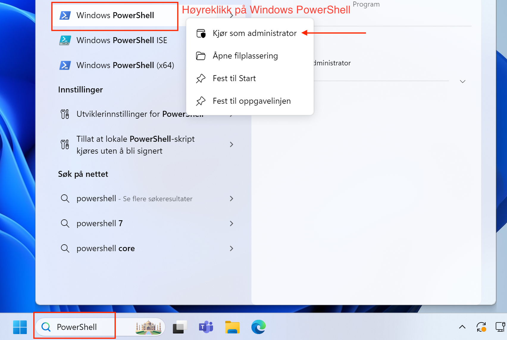
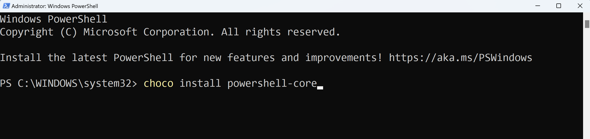

# Kom i gang med PowerShell Core på Windows og Mac

Dette dokumentet vil guide deg gjennom prosessen med å installere og komme i gang med PowerShell Core på både Windows og macOS.

## Windows

For å installere PowerShell Core på Windows, skal vi først installere Chocolatey pakkebehandler, og deretter bruke den til å installere PowerShell.
&nbsp;
### 1. Installere Chocolatey
&nbsp;
1. Åpne Windows PowerShell som administrator.

1. Kjør følgende kommandoer:

```
Set-ExecutionPolicy -ExecutionPolicy RemoteSigned -Scope LocalMachine
```
Deretter:

```
Set-ExecutionPolicy Bypass -Scope Process -Force; [System.Net.ServicePointManager]::SecurityProtocol = [System.Net.ServicePointManager]::SecurityProtocol -bor 3072; iex ((New-Object System.Net.WebClient).DownloadString('https://community.chocolatey.org/install.ps1'))
```

3. Vent til installasjonen er fullført.

&nbsp;
### 2. Installere PowerShell Core
&nbsp;
1. Med Chocolatey installert, kjør følgende kommando i PowerShell (administrator):


```
choco install powershell-core
```

1. Følg eventuelle instruksjoner på skjermen.

&nbsp;
### 3. Verifisere installasjonen
&nbsp;
1. Åpne en ny PowerShell Core terminal.

1. Kjør følgende kommando for å sjekke versjonen:

```
$PSVersionTable
```
&nbsp;


&nbsp;
## macOS
&nbsp;
For å installere PowerShell Core på macOS, skal vi først installere Homebrew pakkebehandler, og deretter bruke den til å installere PowerShell.
&nbsp;
### 1. Installere Homebrew

1. Trykk Command + Space, åpne Terminal.

1. Kjør følgende kommando:

```
/bin/bash -c "$(curl -fsSL https://raw.githubusercontent.com/Homebrew/install/HEAD/install.sh)"
```

3. Følg instruksjonene på skjermen.
&nbsp;
### 2. Installere PowerShell Core
&nbsp;
1. Med Homebrew installert, kjør følgende kommando i Terminal:

```
brew install --cask powershell
```
&nbsp;
### 3. Verifisere installasjonen
&nbsp;
1. Åpne en ny Terminal.
2. Start PowerShell ved å kjøre:

```
pwsh
```

3. I PowerShell, kjør følgende kommando for å sjekke versjonen:

```
$PSVersionTable
```


